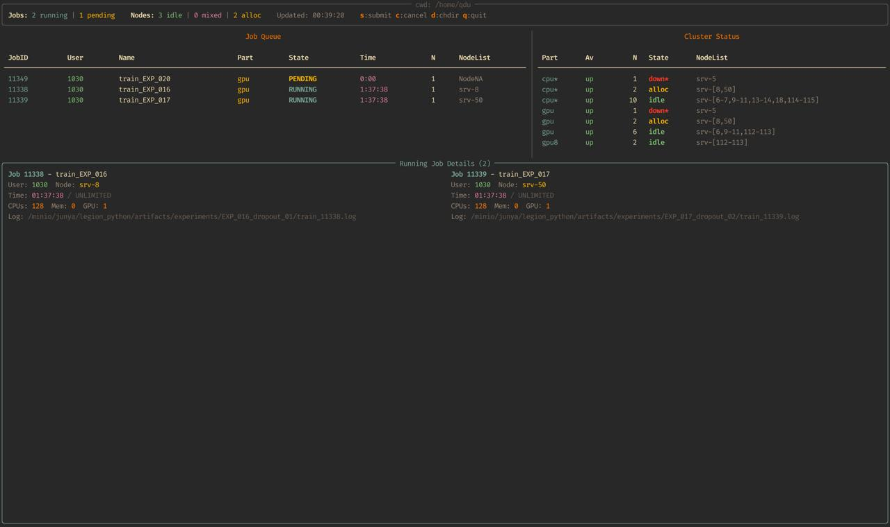

# slurm-tui

A terminal dashboard for monitoring and interacting with a Slurm HPC cluster,
built with Python and [Rich](https://github.com/Textualize/rich).



## Features

- Live-updating job queue and cluster/node status
- Running job details with resource usage and log file paths
- Keyboard-driven actions:
  - `s` submit a job (sbatch)
  - `c` cancel a job (scancel)
  - `d` change working directory
  - `q` quit

## Requirements

- Python 3
- `rich` (`pip install rich`)
- Access to Slurm CLI tools (`squeue`, `sinfo`, `scontrol`, `sbatch`, `scancel`)

## Usage

```
./slurm-tui
```
