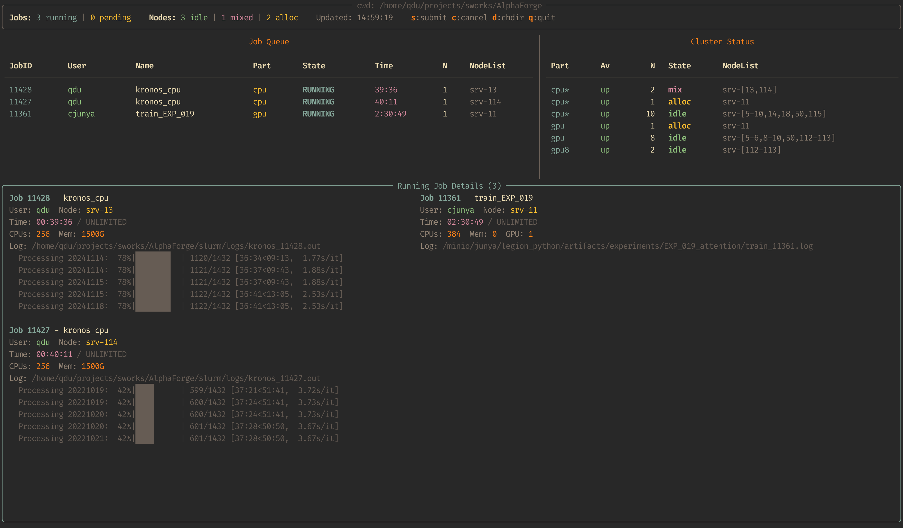
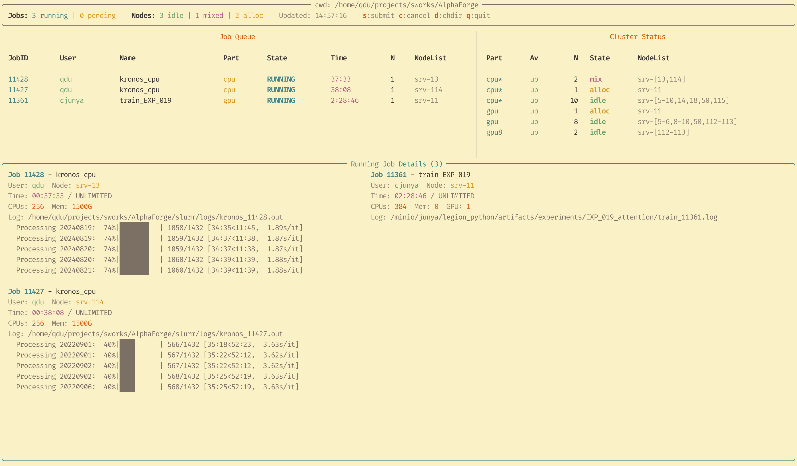
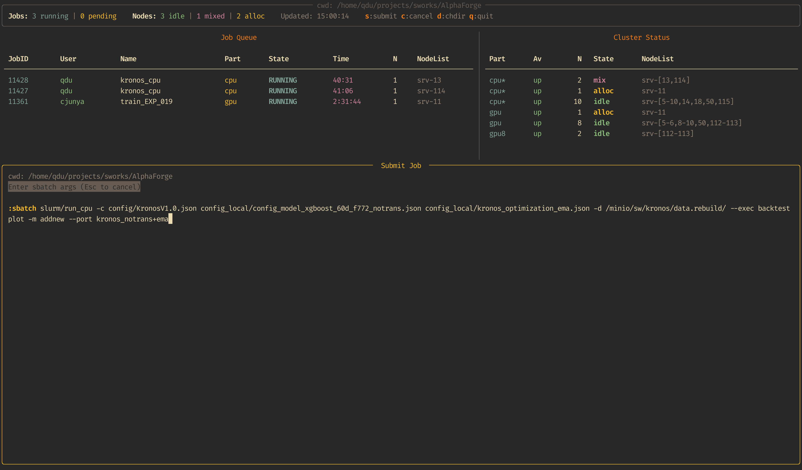
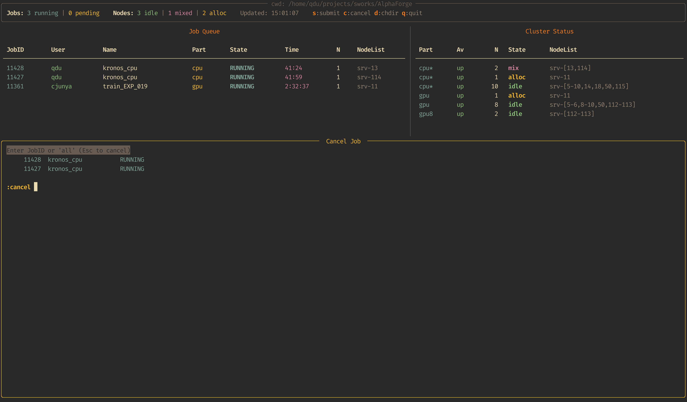

# slurm-tui

A terminal dashboard for monitoring and interacting with a Slurm HPC cluster,
built with Rust and [Ratatui](https://github.com/ratatui/ratatui).

### Dark mode


### Light mode


### Submit job


### Cancel job


## Features

- Live-updating job queue and cluster/node status
- Running job details with resource usage and log file paths
- Keyboard-driven actions:
  - `s` submit a job (sbatch)
  - `c` cancel a job (scancel)
  - `d` change working directory
  - `q` quit

## Requirements

- Rust toolchain (1.85+)
- Access to Slurm CLI tools (`squeue`, `sinfo`, `scontrol`, `sbatch`, `scancel`)

## Build

```
cargo build --release
```

## Usage

```
./target/release/slurm-tui
```

### Options

```
--dark              Use dark background theme (default: light)
--login-node HOST   SSH host for resolving UIDs to usernames
```
